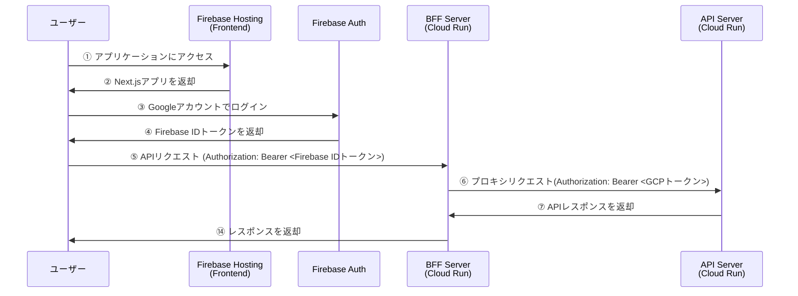

# Cloud Run Sample

このプロジェクトは Google Cloud Platform の Cloud Run を活用した Web アプリケーションサンプルです。
Next.js フロントエンド (UI)、Express.js バックエンド (BFF)、および Go 言語で書かれた API サーバーで構成しています。

## 技術スタック

- **フロントエンド**:
  - Next.js 15 (App Router)
  - Chakra UI v3
  - Firebase Authentication
- **バックエンド**:
  - Express.js (BFF)
  - Go (API)
- **インフラ**:
  - Google Cloud Run
  - Firebase Hosting
  - Cloud Build
  - Terraform
- **パッケージマネージャー**: pnpm v9.15

## 認証
### セキュリティ構成
  - Frontend: Firebase Hostingでホスティング、FirebaseAuthenticationにてクライアント認証
  - BFF: Cloud Run (--allow-unauthenticated)
  - API: Cloud Run (--no-allow-unauthenticated)
  - BFF→API間はGCP認証で保護
### 認証フロー


## プロジェクト構造

```
cloud-run-sample/
├── apps/
│   ├── ui/            # Next.js フロントエンド
│   ├── bff/           # Express.js バックエンド
│   └── api/           # Go API サーバー
├── terraform/         # Terraform コード
│   ├── environments/  # 環境固有の設定
│   └── modules/       # 再利用可能なTerraformモジュール
```

## セットアップ手順

### 前提条件

- Node.js v21 以上
- pnpm v9 以上
- Google Cloud SDK
- Firebase CLI
  - [インストール](https://firebase.google.com/docs/cli?hl=ja#install_the_firebase_cli)
- Terraform v1.9 以上

### 初期セットアップ

1. リポジトリのクローン:

```bash
git clone https://github.com/ryoqn/cloud-run-sample.git
cd cloud-run-sample
```

2. 依存関係のインストール:

```bash
pnpm install
```

3. 環境変数の設定:

フロントエンドの `.env.local` ファイルを作成します:

```bash
# apps/ui/.env.local
NEXT_PUBLIC_FIREBASE_API_KEY=your-api-key
NEXT_PUBLIC_FIREBASE_AUTH_DOMAIN=your-project-id.firebaseapp.com
NEXT_PUBLIC_FIREBASE_PROJECT_ID=your-project-id
NEXT_PUBLIC_FIREBASE_STORAGE_BUCKET=your-project-id.appspot.com
NEXT_PUBLIC_FIREBASE_MESSAGING_SENDER_ID=your-messaging-sender-id
NEXT_PUBLIC_FIREBASE_APP_ID=your-app-id
NEXT_PUBLIC_FIREBASE_MEASUREMENT_ID=your-measurement-id
NEXT_PUBLIC_LOCAL=true
```

### ローカル開発

1. Firebase プロジェクトの設定:

```bash
cd apps/ui
firebase login
firebase init emulators
```

2. Firebase エミュレーターの起動:

```bash
cd apps/ui
pnpm run emulators
```
3. BFFのローカルサーバーを起動:

```bash
cd apps/bff
pnpm run dev
```
4. APIのローカルサーバーを起動:

```bash
cd apps/api
go run main.go
```

**注意事項** ：ローカルではローカルのBFFサーバーにFirebaseエミュレーターを使って接続出来ないので、firebase.jsonの`rewrites`の下記部分をコメントして実行する必要があります。Frontendから直接BFFサーバーにアクセスしています。

```json
"rewrites": [
      // {
      //   "source": "/api{,/**}",
      //   "run": {
      //     "serviceId": "cloud-run-sample-bff",
      //     "region": "asia-northeast2"
      //   }
      // },
      {
        "source": "**",
        "destination": "/index.html"
      }
    ]
```

### デプロイ

#### Firebase Hosting (フロントエンド)

```bash
cd apps/ui
pnpm build
firebase deploy --only hosting
```

#### Cloud Run (BFF と API)

```bash
# Terraform によるインフラストラクチャのデプロイ
cd terraform/environments/dev
terraform init
terraform apply

# または Cloud Build によるデプロイ (CI/CD パイプライン)
git push origin main
```

## CI/CD パイプライン

このプロジェクトは Cloud Build を使用して CI/CD パイプラインを実装しています。`main` ブランチへのプッシュにより、以下の処理が自動的に実行されます:

1. フロントエンドのビルドとデプロイ (Firebase Hosting)
2. BFF のビルドと Cloud Run へのデプロイ
3. API のビルドと Cloud Run へのデプロイ

## インフラストラクチャ管理

インフラストラクチャは Terraform を使用して Infrastructure as Code として管理されています。デプロイされるリソースには以下が含まれます:

- Cloud Run サービス (BFF および API)
- Firebase Hosting の設定
- Artifact Registry リポジトリ
- Cloud Build トリガー
- IAM 権限設定

## ライセンス

MIT
